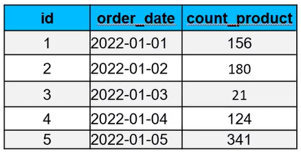
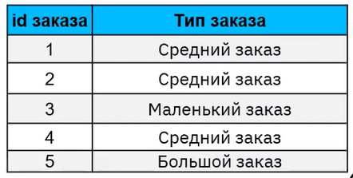
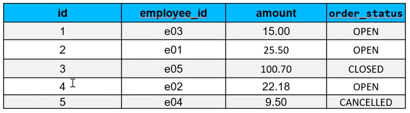

# SQL. Семинар 2. Домашнее задание

1. Используя операторы языка SQL, создайте таблицу “sales”. Заполните ее данными.

2. Для данных таблицы “sales” укажите тип заказа в зависимости от кол-ва :  
меньше 100  -    Маленький заказ  
от 100 до 300 - Средний заказ  
больше 300  -     Большой заказ  

3.  Создайте таблицу “orders”, заполните ее значениями  

- Выберите все заказы. В зависимости от поля order_status выведите столбец full_order_status:  
OPEN – «Order is in open state»;  
CLOSED - «Order is closed»;  
CANCELLED -  «Order is cancelled»

4. Чем 0 отличается от NULL?  
Напишите ответ в комментарии к домашнему заданию на платформе.
